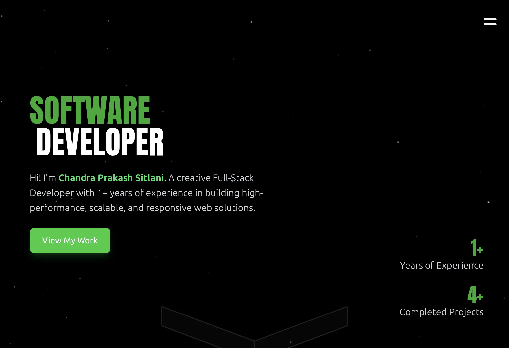
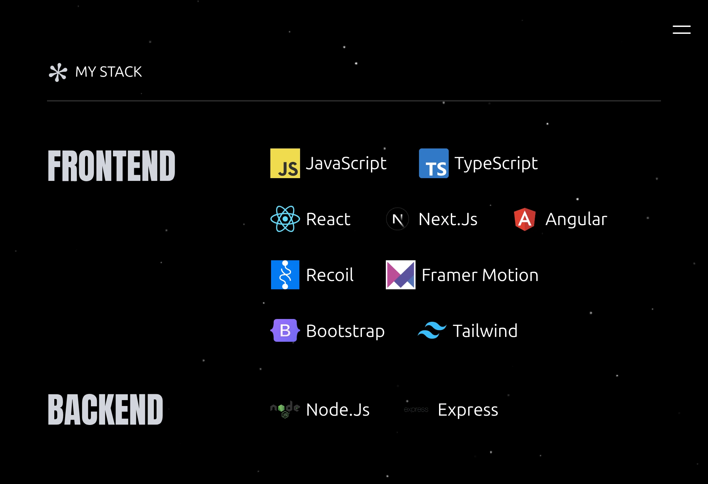
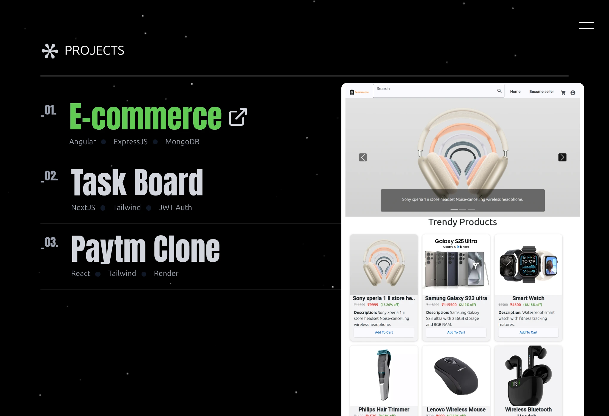

# 🌐 Portfolio Website

This is my personal **portfolio website** built with **React (Vite)** and **Tailwind CSS**.  
It highlights my **projects, skills, and professional experience** in a clean, modern UI.

🔗 [**Live Demo**](https://portfolio-baau.onrender.com/) 

---
## 🛠️ Tech Stack
- **Frontend:** React (Vite), TypeScript, Tailwind CSS  
- **Animations:** Framer Motion  
- **Deployment:** Render  
---
## 🚀 Features
- ⚡ Fast build with **Vite**
- 🎨 Styled using **Tailwind CSS**
- ✨ Smooth animations with **Framer Motion**
- 📱 Fully responsive design (desktop, tablet, mobile)
- 🔗 Showcases **Projects, Experience, Skills, and About Me**

---
## ⚙️ Installation & Setup

Clone the repository:
```bash
git clone https://github.com/ChintuSitlani/portfolio-website.git
cd portfolio-website
npm install
npm run dev
npm run build

```

---

## 📂 Project Structure
portfolio-website/
├── public/ # Static assets (favicon, images, etc.)
├── src/
│ ├── components/ # Reusable UI components
│ │ ├── Background/
│ │ ├── BannerArrow/
│ │ ├── Experience/
│ │ ├── Heading/
│ │ ├── Hero/
│ │ ├── Line/
│ │ ├── MyStack/
│ │ ├── Project/
│ │ ├── SideMenu/
│ │ └── SpinningAsterisk/
│ ├── utils/ # Custom hooks & animation helpers
│ │ ├── animation.ts
│ │ └── useInViewFade.ts
│ ├── App.tsx # Root application component
│ ├── App.css # Global styles
│ ├── main.tsx # Application entry point
│ └── index.css # Tailwind styles
├── package.json
├── vite.config.ts
└── tailwind.config.js

---

📸 Preview

👉 






---

## 🙋‍♂️ Author  
**Chandra Prakash Sitlani**  
- 🔗 [GitHub](https://github.com/ChintuSitlani)  
- 💼 [LinkedIn](https://www.linkedin.com/in/chandra-prakash-sitlani-b9a11536a/)  
- 🌐 [Portfolio](https://portfolio-baau.onrender.com/)


---
## 📃 License

This project is intended for personal use, learning, and job portfolio purposes.

You are welcome to explore and fork the project. Commercial use or redistribution is not permitted without permission.

